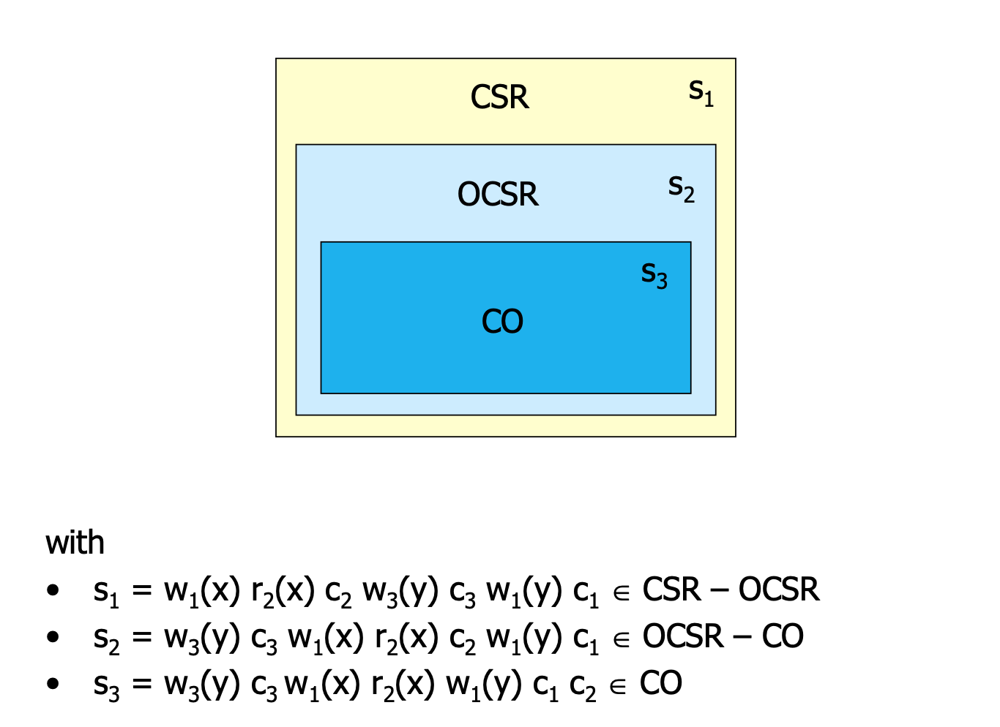
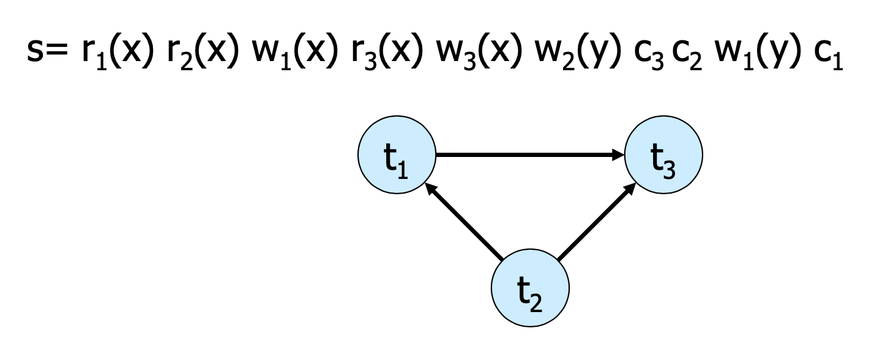
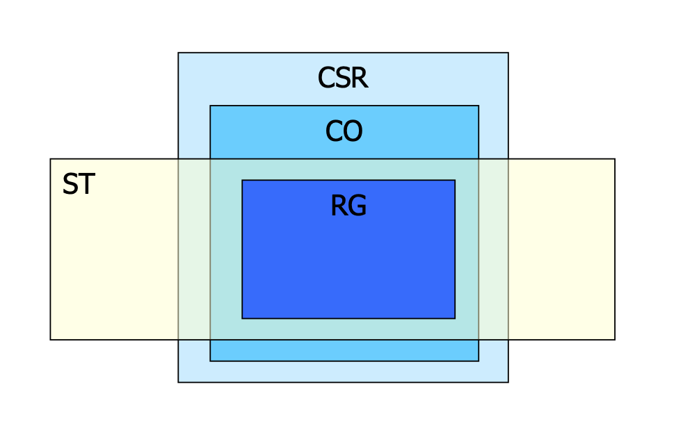
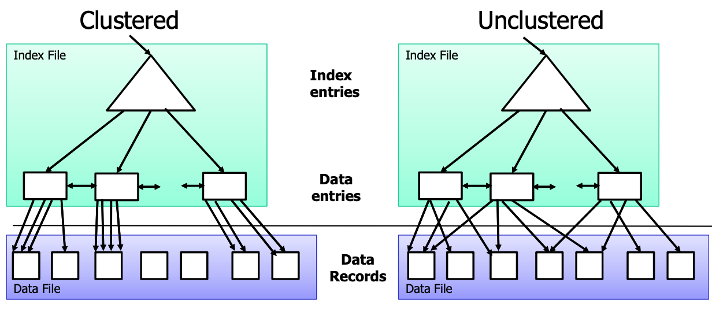

# Architecture of Database Systems

## Goals and Tasks of DBMS

- **Data independence** is the main goal of DBMS. It means that data is managed independent of applications. It refers to the immunity of user applications to changes made in the definition and organisation of data. It makes data available for different applications. There are two types of data independences. 
    - **Physical data independence**: logical schema is independent of physical structure, i.e., relational schema is independent of changes on indexes, clustering, etc.
    - **Logical data independence:** external schema is independent of logical schema, i.e., relational views are defined as derived relations on top of logical schema (the relational schema with the base relations); logical schema might change while external schema does not need to be changed.

- **Five layers**
    - **Logical Data Structure** is mainly for translating and optimising queries. The addressing units between this layer and Transaction Programs are views, tuples and tables. The auxiliary structure is external schema description. And the addressing units to the lower level are external records, sets, keys and access paths. The interface between transaction programs or users and Logical Data Structure is Set‐Oriented Interface (SQL). 
    - **Logical Access Structure** is mainly for managing cursors, sorting components and managing dictionaries. The auxiliary structures are access path data and internal schema description. The addressing units to the lower layer are internal records, B* trees and so on. The interface between Logical Data Structure and Logical Access Structure is Record Oriented Interface for offering logical access path to individual records. 
    - **Storage Structure** is responsible for managing records and indexes. The auxiliary structures are DBTT, FPA, page indexes and so on. The addressing units to the lower layer include page and segments. The interface between Logical Access Structure and Storage Structure is Internal Record Interface, in which records are stored in B* tree.  
    - **Page Assignment** is for managing buffers and segments. The auxiliary structures are page and block tables. The addressing units to the lower layer include blocks and files. The interface between Storage Structure and Page Assignment is System Buffer Interface. 
    - **Memory Assignment Structure** is responsible for managing files and external memories. The auxiliary structures are VTOC, extent tables and system catalogue. The addressing units to Physical Volume are tracks, cylinders, channels and so on. The interface between Page Assignment and Memory Assignment Structure is File Interface. And the interface between Memory Assignment Structure and Physical Volume is Device Interface.  

{ width=550 }

# Advanced Transaction Management

## Definitions

1. A **transaction(TX)** is a DB program, which only consists of read and write operations to a database. These operations are denoted as read(x)or write(x), where xis a DB object.

2. Let $D=\{x,y,z...\}$ be a database.
Then a **transaction** $t(TX)$ is a finite series of operations in the form $r(x)$ („read x“) or w(x) („write x“) denoted as
$t=p_1,...,p_n$
with $n< \infty$, $p_i \in \{r(x),w(x)\}$ for $1\leq i\leq n$ and $x\in D$. Indices are used to distinguish various (concurrent) transactions.

3. Let $T=\{t_1,...,t_n\}$ be a (finite) set of transactions. Thus
    - $shuffle(T)$ is the Shuffle Product of $T$.
   (the sum of all ways of interlacing them, e.g. $ab \cdot xy = abxy + axby + xaby + axyb + xayb + xyab$)
   - a **complete schedule** $s$ for $T$ is a serie $s' \in shuffle(T)$ with the additional pseudo actions $c_i$ (commit) and $a_i$ (abort) for each $t_i \in T$ according to the following rules:
       1. $(\forall i, 1\leq i \leq n) c_i \in s \Leftrightarrow a_i \notin s$
       2. $(\forall i, 1\leq i \leq n) c_i$ or $a_i$ are in $s$, whereever, but after the last action of $t_i$
       
   - $shuffle_{ac}(T)$ is the set of all complete schedules
   - a **schedule** is a prefix of a complete schedule
   - a complete schedule is **serial,** if for a permutation $\rho$ from {1,...,n} it holds that all the transactions run one after the other without any interference with one another (no e.g. dirty read) they are terrible from a performance point of view because we have to wait until a transaction finishes executing to execute the next one:
   $$ s= t_{\rho (1)} ... t_{\rho (n)} $$

4. Notation for Schedule s

   - trans(s) = $\{ t_i | s \text{ contains actions of } t_i\}$

   - commit(s) = $\{ t_i \in \text{ trans(s) } | c_i \in s \}$

   - abort(s)= $\{t_i \in \text{ trans(s) } | a_i \in s\}$

   - active(s)= trans(s) – (commit(s) $\cup$ abort(s)) 

   - op(s) = set of all the actions occurring in s

## Synchronization Problems

- Lost update 

- Dirty read

- Non-repeatable read/Inconsistent read

- Phantom Problem

### ACID Principle
Every transaction must be processed in the way that the ACID properties are preserved.

- **Atomicity**: In an execution of a transaction, either all operations are carried out, or none are.
- **Consistency**: Preservation of all integrity constraints of the DB, i.e. a transaction starts with a consistent DB state, and after the execution of the transaction the DB state is consistent as well.
- **Isolation**: Isolated execution of a transaction, i.e. „as if executed solely“
- **Durability**: Once a transaction has been successfully completed, its effects should persist even if the system crashes before all its changes

## Serializability Theory
### Definitions

Let $s$ and $s'$ be schedules. $s$ and $s'$ are called **final-state equivalent,** denoted as $s \approx_f s'$, if $op(s) = op(s')$ and all DB objects have at the end identical values in $s$ and $s'$, according to the abstract semantics.

A schedule $s$ is called **final-state serializable** if there exists a serial schedule $s'$ which is final-state equivalent to $s$.
$FSR$ is the class of all final-state serializable schedules.

**Example 1:**  
$s= r1(x) r2(y) w1(y) r3(z) w3(z) r2(x) w2(z) w1(x)$ and   
$s'= r3(z) w3(z) r2(y) r2(x) w2(z) r1(x) w1(y) w1(x)$.

In $s$: $x=f_{1x}(x_0)$ $y= f_{1y}(x_0)$ $z= f_{2z}(x_0,y_0)$   
In $s'$: $x=f_{1x}(x_0)$   $y= f_{1y}(x_0)$ $z= f_{2z}(x_0,y_0)$  
$\Longrightarrow s \approx_f s' \Longrightarrow s \in FSR$ 

**Example 2:**  
$s= r_1(x) r_2(y) w_1(y) w_2(y) c_1 c_2$  
$s' = r_1(x) w_1(y) r_2(y) w_2(y) c_2 c_1$

In $s:  y=f_{2y}(y_0)$  
In $s': y=f_{2y}(f_{1y}(x_0))$  
$\Longrightarrow s$ $\approx_f s' \Longrightarrow s \notin FSR$
<!-- pandoc doesn't properly read \not -->

## Conflict Serializability Classes

Let $s$ be a schedule, $t, t' \in$ trans(s) and $t \neq t'$:

- Two data operations $p \in t$ and $q \in t'$ in $s$ are in **conflict,** if they operate on the same object and at least one of them is a write operation.
- $C(s)=\{(p,q)|p, q$ in $s$ are in conflict and $p$ is before $q$ in $s\}$ are the **conflict relations** of s.

**Example**  
Let $s= w_1(x) r_2(x) w_2(y) r_1(y) w_1(y) w_3(x) w_3(y) c_1 a_2$.  

Then: $C(s)$ = {($w_1(x)$, $r_2(x)$), ($w_1(x)$, $w_3(x)$), ($r_2(x)$, $w_3(x)$), ($w_2(y)$, $r_1(y)$), ($w_2(y)$, $w_1(y)$), ($w_2(y)$, $w_3(y)$),
($r_1(y)$, $w_3(y)$), ($w_1(y)$, $w_3(y)$)}.

$\Longrightarrow conf(s) = { (w_1(x), w_3(x)), (r_1(y), w_3(y)), (w_1(y), w_3(y))}.$ Conflict relations with an operation of transaction 2 have been removed.

$conf(s)$ denotes the conflict relations of a schedule s, which are cleaned up by aborted transactions.

Three Serializability classes will be presented: $CSR$, $OCSR$ and $CO$.

### $CSR$

- Let $s$ and $s'$ be two schedules. $s$ and $s'$ are called **conflict equivalent**, denoted as $s \approx_c s'$, if:
  - $op(s)=op(s')$ and 
  - $conf(s)=conf(s')$.

- A complete schedule $s$ is called **conflict serializable**, if a serial schedule $s'$ exists with $s \approx_c s'$.

- The **conflict graph**

**Theorem 2.2**:  
 $s \in CSR \Leftrightarrow G(s)$ is acyclic.   
 (Because the transitions can be ordered $t_2,t_1,t_3$ in the example)  
 **Membership** in CSR can be tested in polynominal time

### $OCSR$

 A complete schedule s is called **order-preserving conflict serializable**, there exists a serial schedule $s'$ with $s \approx_c s’$ and the following holds for all $t,t' \in trans(s)$:  
If $t$ occurs completely before $t'$ in $s$, then the same holds in $s'$.   

### $CO$

A schedule s is called **commit order-preserving conflict serializable** (or owns the property of **commit order preservation**),
if the following holds:  
For all $t_i, t_j \in commit(s), i \neq j$, with $(p,q) \in conf(s)$ for $p \in t_i, q \in t_j$,   
then : $c_i$ is before $c_j$ in $s$.

## Recovery Theory

### $RC$
A schedule s is called **recoverable**, if the following holds:  
$(\forall t_i, t_j \in trans(s), i \neq j)$ $t_i$ reads from $t_j$ in $s$ $\land c_i \in s \Rightarrow c_j <_s c_i$  
(If transaction 2 reads from transaction 1, then transaction 1 commits before transaction 2)  
„Every transaction will not be released, until all other transactions from which it has read, are released.“  

**Example**:  
Let $s1=w_1(x) w_1(y) r_2(u) w_2(x) r_2(y) w_2(y) c_2 w_1(z) c_1$  
It holds: $t_2$ reads $y$ from $t_1$ and $c_2 \in s$, but $c_1 \nless c_2$.  Consequently $s_1 \notin RC$

Let $s_2=w_1(x) w_1(y) r_2(u) w_2(x) r_2(y) w_2(y) w_1(z) c_1 c_2$  
It holds: $s_2 \in RC$, because the commit operation of $t_2$ is after the one of $t_1$ , but the abort of $t_1$ leads to the abort of $t_2$, this may give rise to cascading aborts.

### $ACA$
A schedule $s$ **avoids cascading aborts**, if it holds:  
$(\forall t_i, t_j \in trans(s), i \neq j)$ $t_i$ reads $x$ from $t_j$ in $s$ $\Rightarrow c_j <_s r_i(x)$    
„A transaction is only allowed to read values from already successfully completed transactions.“ 

**Example**:  
$s2=w1(x) w1(y) r2(u) w2(x) r2(y) w2(y) w1(z) c1 c2 \notin ACA$  
$s3=w1(x) w1(y) r2(u) w2(x) w1(z) c1 r2(y) w2(y) c2 \in ACA$  
Further problem: The values, which are restored after an abort, may be different from the Before Images of the write operations of the aborting transactions.

### $ST$
A schedule $s$ is called **strict**, if the following holds:  
$(\forall t_i \in trans(s))(\forall p_i(x) \in op(t_i), p \in {r,w})$  
$w_j(x) <_s  p_i(x), i\neq j \Rightarrow a_j <_s p_i(x) \lor c_j <_s p_i(x)$  
„A schedule is strict, if an object is not read or overwritten, until the transction, which has written it at last, is terminated.“ (Same as before but now also with the write operation)   

**Example**:  
$s_3 =w_1(x) w_1(y) r_2(u) w_2(x) w_1(z) c_1 r_2(y) w_2(y) c_2 \notin ST$   
$s_4 =w_1(x) w_1(y) r_2(u) w_1(z) c_1 w_2(x) r_2(y) w_2(y) c_2 \in ST$

### $RG$
A schedule $s$ is called **rigorous**, if it is strict and satisfies the following condition:  
$(\forall t_i ,t_j \in trans(s)) r_j(x) <_s w_i(x), i \neq j \Rightarrow a_j <_s w_i(x) \lor c_j <_s w_i(x)$  
„A schedule is rigorous, if it is strict and no object x is overwritten, until all transactions, which have read x at last, are terminated.“

- A schedule from ST avoids Write-Read- as well as Write-Write conflicts between non-released transactions
- A schedule from RG avoids additionally Read-Write conflicts between those kinds of transactions.

## Scheduling Algorithms

Techniques with which a DBMS can generate correct schedules for transactions to be processed; these are called scheduling protocols, or in short **scheduler**. A scheduler gets as input a sequence of operations (r,w,a,c) and it must produce a correct output schedule from them.

### Locking Scheduler

The scheduler can apply locks for the synchronization of accesses on data objects that are used together. There are two types of locks for an object x:
- Read lock: rl(x) *read lock*, ru(x) *read unlock*
- Write lock: wl(x) *read lock*, wu(x) *read unlock*

**Rules for the application of locks**  
For each $t_i$, which is contained completely in a schedule $s$, the following should be valid:

1. If $t_i$ contains a $r_i(x)[w_i(x)]$, thus $rl_i(x)[wl_i(x)]$ stands anywhere before it in $s$ and $ru_i(x)[wu_i(x)]$ stands anywhere after it.
2. For each $x$ processed by $t_i$ there are exactly one $rl_i(x)$ resp. $wl_i(x)$ in $s$
3. No $ru_i/wu_i$ is redundant

**Examples:**  
$s_1= rl_1(x) r_1(x) ru_1(x) wl_2(x) w_2(x) wl_2(y) w_2(y) wu_2(x) wu_2(y) c_2 wl_1(y) w_1(y) wu_1(y) c_1$  
$s_2= rl_1(x) r_1(x) wl_1(y) w_1(y) ru_1(x) wu_1(y) c_1 wl_2(x) w_2(x) wl_2(y) w_2(y) wu_2(x) wu_2(y) c_2$

A scheduler **works according to a locking protocol**, if for every output $s$ and every $t_i \in trans(s)$ it holds:
- $t_i$ satisfies the rules 1. to 3 for the application of locks.
- If $x$ is locked by $t_i$ and $t_j, t_i , t_j \in trans(s), i \neq j$, then these locks are compatible

### Two Phase Locking (2PL)

A locking protocol is **two phase**, if for every generated schedule $s$ and every transaction $t_i \in trans(s)$ it holds:  
After the first $ou_i$ action there is no further $ql_i$ action $(o,q \in \{r,w\})$. Such a scheduler is called a **2PL scheduler**.  
"In the first phase of a transaction locks will only be set, in the second phase locks will only be removed."

**Examples**:  
$s_1=rl_1(x) r_1(x) ru_1(x) wl_2(x) w_2(x) wl_2(y) w_2(y) wu_2(x) wu_2(y) c_2 wl_1(y) w_1(y) wu_1(y) c_1$  
$s_1$ is not 2PL.
$s_2=rl_1(x) r_1(x) wl_1(y) w_1(y) ru_1(x) wu_1(y) c_1 wl_2(x) w_2(x) wl_2(y) w_2(y) wu_2(x) wu_2(y) c_2$  
$s_2$ is 2PL

**Theorem 2.2**  
$\varepsilon (2PL) \subseteq CSR$

**Variants of 2PL**
- Conservative 2PL : All locks are available since BOT
- Strict 2PL (S2PL): Hold all write locks till EOT
- Strong 2PL (SS2PL): Hold all locks till EOT

**Theorem 2.3**  
$\varepsilon (S2PL) \subseteq CSR \cap ST$

### Multi-Granularity Locking (MGL)

- Each transaction can choose the suitable granularity by itself. (in the example below: record file, table space, area, database) (You can choose to lock the entire File 1 or Area 2 for example)(If something below is locked, you can't lock above, that's where intention locks come in handy)
- The scheduler must then prevent transactions from setting conflicting locks in overlapping granularities.  
  
If the database is tree-structured, two provisions are helpful :
- Distinction between explicit and implicit locks (higher-level locks implicitly lock also lower level objects)
- Propagation of locks in tree upwards as **intention locks** ($irl$, $iwl$, $riwl$)

Each transaction $t_i$ is locked/unlocked as follows:
1. If $x$ is not the root of the database, $t_i$ must own a $ir$- or $iw$-lock on the parent node of $x$, in order to be able to set $rl_i(x)$ or $irl_i(x)$.
2. If $x$ is not the root of the database, $t_i$ must own a $iw$-lock on the parent node of $x$, in order to be able to set $wl_i(x)$ or $iwl_i(x)$.
3. To read (write) $x$, $t_i$ must own a $r$-lock or $w$-lock on $x$.
4. $t_i$ cannot remove an intentional lock on $x$, as long as $t_i$ has still a lock on a child of $x$.

**Summary**: _Locks are set top-down and removed bottom-up_.  
We can prove that, for every transaction, which keeps the 2-Phase rules, $\varepsilon(MGL) \subseteq CSR$ is valid.

### Index Locking

Assumption so far:
- DB is a fixed collection of independent objects
- Even Strict 2PL might not guarantee serializability if objects are added during a transaction.
  
**Example**: (Phantom Problem, assume page-level locking is used)

1. T1 locks all pages containing person records with sex=male, and finds oldest
person (e.g. age=71)
2. T2 inserts a new male person with age=96
1. This record is inserted on a different page than the pages locked by T1
3. T2 deletes oldest female person with age=80
1. This record is also located on a page which is not locked by T1
4. T2 commits
5. T1 now locks all pages containing female person records and finds oldest (e.g. age=75)
   
$\Longrightarrow$ There is no consistent DB state where T1 is correct!

- T1 implicitly assumes that it has locked the set of all male person records
  - This is true only if no records are added while T1 is executed. Thus, some mechanism to enforce this assumption is needed.
- The example shows that conflict serializability is guaranteed only if the set of objects is fixed.
- Possible Solutions
    - No Index: T1 has to lock all pages and the file/table to prevent new records/pages being added – very inefficient!
    - Index on sex field:
        - T1 needs to lock the index page with data entries for sex=male
        -  If there are no such records yet, T1 must lock the index page where such a data entry would be created.

### B+ Trees and the Simple Locking Algorithm

A B+-tree of type $(k, k*)$ is a multi-path tree with the following properties:

- Every node has one more references than it has keys.
- All leaves are at the same distance from the root.
- For every non-leaf node $N$ with $k$ being the number of keys in $N$: all keys in the first child's subtree are less than $N$'s first key; and all keys in the ith child's subtree $(2 ≤ i ≤ k)$ are between the $(i − 1)$th key of n and the $i$th key of $n$.
- The root has at least two children.
- Every non-leaf, non-root node has at least $floor(d / 2)$ children.
- Each leaf contains at least $floor(d / 2)$ keys.
- Every key from the table appears in a leaf, in left-to-right sorted order.

There are two operations on a B+ tree that make modifies it:
  
**Insertion**

- Descend to the leaf where the key fits.
- If the node has an empty space, insert the key into the node.
- _Redistribute Phase_: If the node is already full, split it into two nodes, distributing the keys evenly between the two nodes.
  - If the node is a leaf: take a copy of the minimum value in the second of these two nodes and repeat this insertion algorithm to insert it into the parent node.
  - If the node is a non-leaf: exclude the middle value during the split and repeat this insertion algorithm to insert this excluded value into the parent node.

**Deletion**

- Remove the required key from the node.
- If the node still has enough keys to satisfy the invariant, stop.
- _Redistribute Step_: If the node has too few keys to satisfy the invariants, but its next oldest or next youngest sibling at the same level has more than necessary, distribute the keys between this node and the neighbor. Repair the keys in the level above to represent that these nodes now have a different "split point" between them; this involves simply changing a key in the levels above, without deletion or insertion.
- _Merge step_: If the node has too few keys to satisfy the invariant, and the next oldest or next youngest sibling is at the minimum for the invarant, then merge the node with its sibling; if the node is a non-leaf, we will need to incorporate the "split key" from the parent into our merging. In either case, we will need to repeat the removal algorithm on the parent node to remove the "split key" that previously separated these merged nodes - unless the parent is the root and we are removing the final key from the root, in which case the merged node becomes the new root (and the tree has become one level shorter than before).

**Simple Locking Algorithm**  
The Simple Locking Algorithm is an example of index locking. We set/remove locks in the following way:

- **Search**: We begin at the root and go down. On each level we $rl$ the child and unlock the parent. This until we reach the leaf.

- **Insert/Delete**: We also begin at the root and go down. On each level we $wl$ the child and then check if it is safe. A node is safe if the changes made will not propagate up beyond the node. In insertions, a node is safe if it is not full. In deletions, a node is safe if it not half empty. If the node is safe, then unlock all of its ancestors.

A con of the Simple Locking Algorithm is that the $wl$ that we put on nodes that are not leafs are unnecessary, because only the leaf nodes are modified. The leaf nodes are the only ones that contain data.

## Recovery Protocols

Read or write operations refer to a page of secondary storage.

- **Fetch**: (read operation) transfers a page from the database into the buffer, if the corresponding page is not yet in the buffer.
- **Flush**: after a write operation modifies the content of a page, which must be in the buffer; the page can be written to the database (flushed) at once or later.

Theoretically, all changes on objects $o$ made by $t$ (write operations) should be flushed to disk exactly at commit. Unfortunately this would create a number of problems:

- **Steal** (The risk of Early Disk Writing): usually the operative system and not the database system decides how the pages are used, so the buffer manager might choose to replace the frame in memory which contains the page with the object $o$ (i.e. a frame is stolen from $t$).   
In this case things are written on the disk before the commit, which could possibly lead to dirty reads.
- **Force** (What about Late Disk Writing?): It is not optimal to always write on the disk at commit points (force), because this creates a lot of disk access requests at the same time and affects performance. If we allow changes to be flushed after commit (no force), the performance would increase.

Data Manager and Transaction Manager

The types of faults, which a DBMS must be able to handle:

1. **Transaction faults**: a transaction does not reach its commit point, e.g. by an error in program or an involvement in a deadlock.
2. **System crash**: parts of (volatile) main memory or buffers get lost, e.g. by errors in DBMS codes, in operating systems or hardwares.
3. **Media fault**: parts of (non-volatile) secondary storage get lost, e.g. by a head crash on a disk, faults in an operating system routine for the writes onto disks.

In the following only fault types (1) and (2) will be considered.

Crash Scenario

Transactions are classified now in two classes:

- Transactions, which were **already released** before the fault. These need a **REDO**, if results are not permanently stored (No- Force situation).
- Transactions, which were **still active** by the time of the fault. These need an **UNDO**, if some results are already stored on disk (Steal situation).

The Recovery Manager (RM) maintains a **log** file :

- If $t$ wants to write a new value of $x$, a ***Before-Image*** of $x$ is written in the log beforehand (consisting of the ID of $t$, the ID of $x$ and the old value of $x$).
- The new value of $x$ is logged in an ***After-Image*** (consisting of IDs for $t$ and $x$ as well as the new value of $x$).   
To execute a REDO or UNDO of $t$, the log entries for t are read and processed in reverse sequence.
Recovery protocols are classified whether only *After-Images* or only *Before-Images* or both (most systems) are stored.

Any protocol must satisfy the UNDO and REDO rules:

- UNDO-rule („Write-Ahead-Log-Protocol“):
The Before-Image of a write operation (the old value of x) must be written into the log, before the new value appears in the stable database.
- REDO-rule(„Commit-rule“):
Before a transaction is terminated, every new value that has been written by it must be in the stable storage (in the stable database or in log).

Direct consequence:

- For No-REDO: ensure that all After-Images of a transaction are written in the database before or during the commit.
- For No-UNDO: ensure,that no After-Image of a transaction is written into the database (but only the log) before the commit.

# Relational Queries

DB Schema

Dept(Department):

- dno: department number (key)
- dname: department name
- mgr: managers (foreign key)

Empl(Employee):

- eno: employee number (key)
- name: employee name
- marstat: marital status
- salary
- dno: department number (foreign key)

Office:

- floor
- room
- eno: employee number (foreign key)

